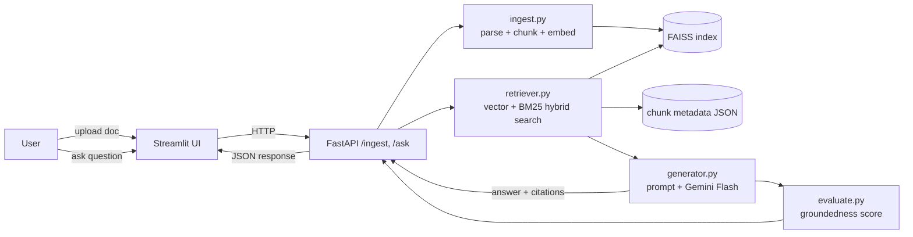

# RAG Document QA

Upload a PDF or text document, ask questions about it in plain English, and
get answers grounded in the document's content with page-level source
citations.

## Architecture



**Pipeline, step by step:**

1. **Ingest** (`src/ingest.py`) — PyMuPDF extracts text page-by-page from the
   uploaded PDF (or reads a `.txt`/`.md` file directly). Each page's text is
   split with LangChain's `RecursiveCharacterTextSplitter` into ~1000
   character chunks with a 200 character overlap, so context isn't lost at
   chunk boundaries. Each chunk keeps its source page number for citations.
2. **Embed + index** — chunks are embedded locally and for free with
   `sentence-transformers` (`all-MiniLM-L6-v2`) and stored in a FAISS
   `IndexFlatIP` (embeddings are L2-normalized, so inner product = cosine
   similarity). A JSON sidecar file holds the raw chunk text and metadata.
3. **Retrieve** (`src/retriever.py`) — a query is answered with **hybrid
   retrieval**: dense FAISS vector search (good at paraphrases/meaning) and
   sparse BM25 keyword search (good at exact terms, numbers, names) are run
   independently, then merged with **Reciprocal Rank Fusion** so we don't
   have to normalize two incompatible score scales.
4. **Generate** (`src/generator.py`) — the top-k chunks are numbered and
   inserted into a prompt that instructs the LLM (Gemini Flash, on Google's
   free tier) to answer using
   only that context and to cite each claim as `[n]`. The response's
   citation markers are mapped back to the original chunk text/page for
   display.
5. **Evaluate** (`src/evaluate.py`) — a lightweight, no-extra-API-call
   groundedness check splits the answer into sentences and measures each
   sentence's max cosine similarity to the retrieved chunks. This produces a
   "% grounded" score shown in the UI and is also used as an automated
   regression check in the test suite.

## Repo layout

```
src/ingest.py             parse, chunk, embed, store in FAISS
src/retriever.py          hybrid (vector + BM25) retrieval
src/generator.py          prompt construction + Gemini call + citations
src/evaluate.py           groundedness scoring
src/embeddings.py         shared embedding helper
api/app.py                FastAPI service (/ingest, /ask)
app/streamlit_app.py      Streamlit frontend
tests/                    pytest unit tests (chunking, retrieval, generator, eval)
.github/workflows/ci.yml  GitHub Actions: runs pytest on every push/PR
sample_docs/              a small sample doc for trying the demo
```

## Running it in Google Colab

This project was built to be run end-to-end from a single Colab notebook —
see **`RAG_Document_QA_Colab.ipynb`**. It will:

1. Write all the files above into a local `rag-document-qa/` folder.
2. Install dependencies.
3. Walk through an ingest → ask → evaluate demo using the sample document.
4. Run the test suite.
5. Push the project to a **new** GitHub repo (`rag-document-qa`) using a
   personal access token.
6. Launch the FastAPI service and the Streamlit UI, tunneled to a public URL
   with `pyngrok`, so you can use the actual upload-and-ask demo in your
   browser.

Before running it, add two Colab secrets (key icon in the left sidebar):

- `GEMINI_API_KEY` — your Gemini API key, free with no credit card at
  https://aistudio.google.com/apikey (for the answer-generation step)
- `GITHUB_TOKEN` — a GitHub personal access token with `repo` scope (only
  needed if you want the notebook to create and push the repo for you)

## Running it locally (outside Colab)

```bash
git clone https://github.com/<your-username>/rag-document-qa.git
cd rag-document-qa
pip install -r requirements.txt
export GEMINI_API_KEY=...

# Terminal 1 — API
uvicorn api.app:app --reload --port 8000

# Terminal 2 — UI
streamlit run app/streamlit_app.py
```

Then open the Streamlit URL it prints, upload `sample_docs/acme_q3_summary.txt`
(or your own PDF), and start asking questions.

## Running the tests

```bash
pytest tests/ -v
```

Tests use a deterministic fake embedding (see `tests/conftest.py`) instead of
downloading the real sentence-transformers model, so the suite runs in a few
seconds, fully offline — which is also what keeps CI fast in
`.github/workflows/ci.yml`.

## Design notes / things to point out in a writeup or demo

- **Chunking with overlap**: tested directly in `tests/test_chunking.py`
  (size bounds, overlapping content between neighboring chunks, page number
  preservation).
- **Hybrid retrieval**: `src/retriever.py` runs FAISS and BM25 independently
  and fuses rankings with RRF rather than trying to blend cosine similarity
  and BM25 scores on the same scale.
- **Prompt engineering with citations**: the system prompt in
  `src/generator.py` forces numbered `[n]` citations and an explicit
  "I don't know" fallback instead of guessing.
- **Evaluation framework**: `src/evaluate.py`'s groundedness score is a
  cheap, automatable proxy for hallucination — no second LLM call required.
- **Free end to end**: parsing, chunking, embedding, and retrieval are free
  and local; generation uses Gemini's free API tier (Flash model), so the
  whole pipeline runs at no cost for personal/demo-scale usage.
